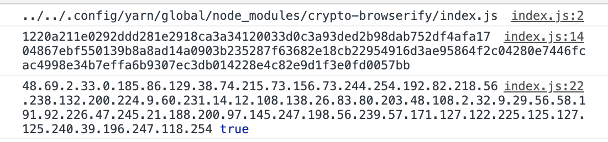

## Javascript bundler mysteries! Can we do that on browser ? 

So, I was working on some experimental crypto stuff today when I literally became the guy on the famous meme myself. 


<div style="text-align:center">

</div>

The idea is to create a simple digital signature using `secp256k1`. For more info check [secp256k1](https://en.bitcoin.it/wiki/Secp256k1) , [Elliptic Curve Digital Signature Algorithm](https://en.bitcoin.it/wiki/Elliptic_Curve_Digital_Signature_Algorithm)

I was trying a simple gist that will : 
- create a keypair
- take a message
- hash it
- sign the hash with the private key
- verify the signature with public key

Example code is here : 

```js
const crypto = require("crypto")

const EC = require('elliptic').ec;
const hash = data => crypto.createHash('sha256').update(data).digest("hex")
// Create and initialize EC context
// (better do it once and reuse it)
const ec = new EC('secp256k1');

// Generate keys
const keys = ec.genKeyPair();
const publicKey = keys.getPublic("hex")
const privateKey = keys.getPrivate("hex")

console.log(privateKey,publicKey)

const sign = (data, privateKey) => ec.keyFromPrivate(privateKey).sign(hash(data)).toDER()
const verify = (data, signature, publicKey) => ec.keyFromPublic(publicKey, "hex").verify(hash(data), signature)

const data = "Hello"
const signature = sign(data, privateKey)

console.log(signature.join("."),verify(data,signature, publicKey))

```

Now I try to run my code : `node index.js` . IT WORKS! 

Afterwards, I wanted to be able to sign on the browser as well. 
Since `crypto` is a core node module I wasn't expecting it first to work on browser. 

My first attempt was to use [parcel-bundler](https://parceljs.org/) . 

- Create an `index.html`
- Call `<script src="./index.js">` in `index.html`
- Run `parcel index.html` 
- *Voilá!* On the browser it works!

But then I was like "Why does it work ?"

I wanted to know where `crypto` module was required. So added a new line to my code on top: 

```
const crypto = require("crypto")
console.log(require.resolve('crypto'))
const EC = require('elliptic').ec;

...

```

When I run `node index.js` that `console.log` prints the String `crypto` only. But on the browser console there was something uncanny! 

<div style="text-align:center">

</div>

Did you see that `../../.config/yarn/global/node_modules/crypto-browserify/index.js` too ? 

I packed up my backpack, kissed me darling mother and went on an adventure of stalking code, sniffing the github repos. Even though I though it was going to be a needle in the haystack I came across some resources which actually revealed the mystery. 

Turns out [browserify](https://github.com/browserify/browserify/blob/ae01d90900b21719e9fef7bedfc4db55ea22b71a/lib/builtins.js) has a `builtins.js` that maps some of the nodejs core modules to their browser equivalents and in build-time, requires them. 

I found out [parcel](https://github.com/parcel-bundler/parcel/blob/master/packages/core/parcel-bundler/src/builtins/index.js#L1) and [webpack](https://github.com/webpack/webpack/blob/573d2da1d946b59ef6990cea0edf31958d13c0d6/lib/node/NodeSourcePlugin.js) use a webpack-core library called `node-libs-browser` to replace those modules with their browser equivalents. 

I couldn't find any explanation about this *feature* in any of their documentation. Even though it bugs me to find out there is some magic happening ebhind the curtains, sometimes it is nice to have those kind of out of the box features. This feature did not only saved me time, but also added fun to this evening! 

Peace!